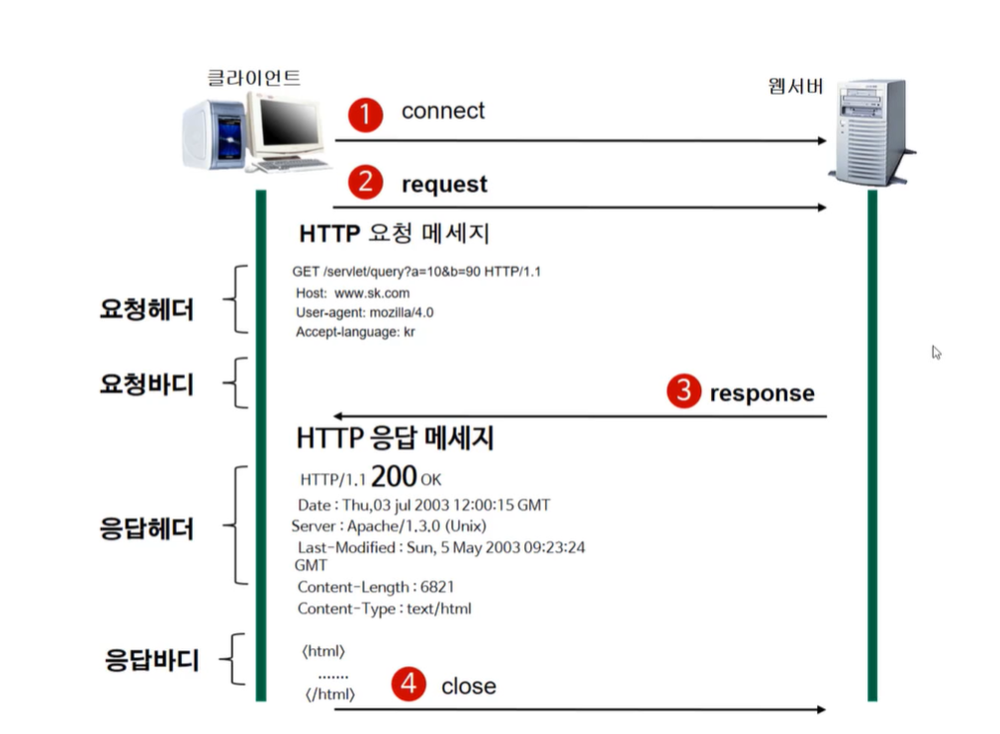
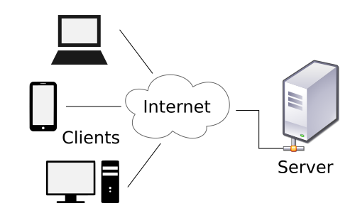
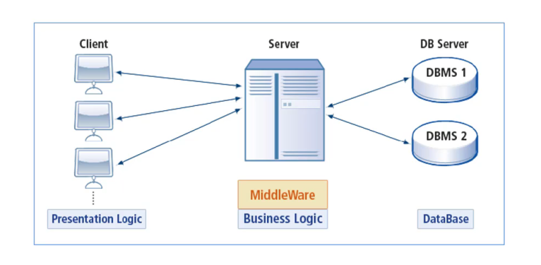
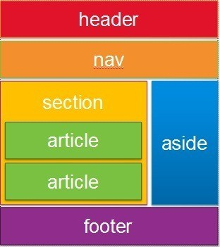
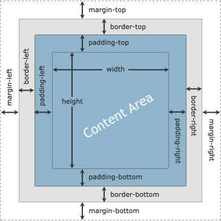
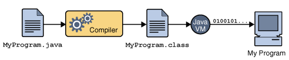
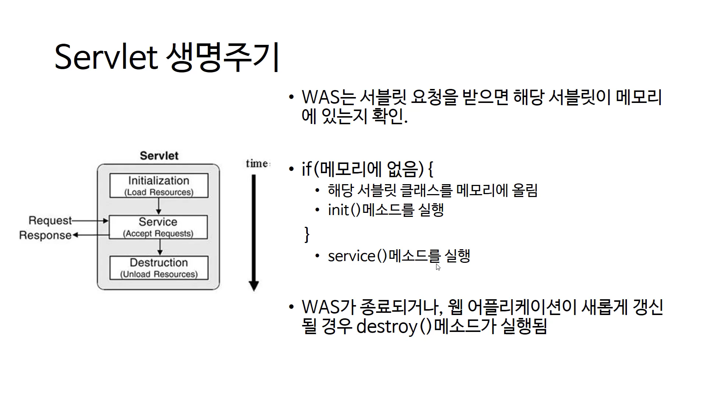
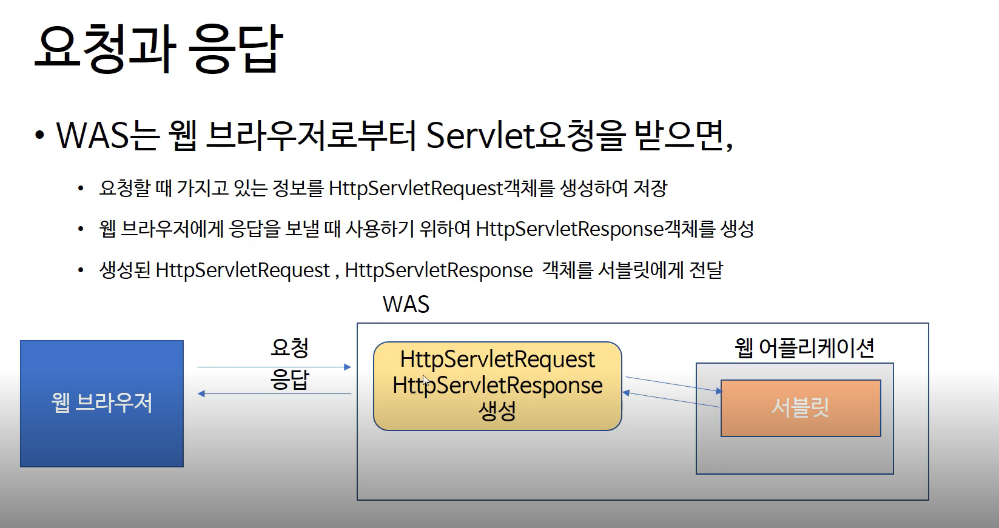

# Part1. 웹 프로그래밍 기초

## 웹프론트엔드

- 프론트엔드와 백엔드의 역활과 관계
- HTML로 웹페이지 구조 설계
- CSS 레이아웃에 필요한 속성과 활용방법

## 웹 백엔드

- 웹 개발에 대한 이해
- 개발 환경 설정
- Servlet

## 과정에서 배울수있는것.

- cs와 프로그래밍에 대한지식
- 커리어 전환을 원하는 개발자
- JAVA, HTML/CSS, SQL의 기초적인 핵심 문법

## 과정 핵심

- HTML/CSS
- Javascript
- JAVA
- Spring
- Spring MVC
- Spring JDBC
- SQL

--

## 웹(FE/BE)분야의 개발자는 어떤 역략이 중요한가

1. CSS와 같은 선언적인 프로그래밍에도 익숙해야한다
2. interactive한 웹개발 방법과 성능에 유리한 패턴방식 이해
3. 새로운것을 거부감없이 받아들이는 능력
4. 커뮤니케이션 능력 -> 스터디추천 / 구현체에 대해 구현자의 초점을 이해하는 능력

\*\* interactive : 활동적인 / 쌍방향

## 웹 분야 개발자가 되려면 배워야할것들

1. javascipt
2. HTML/CSS 구조 설계 스타일
3. 프로그래밍 언어 1개는 자유자제로 사용 / 역사적인 배경

--

- 기계어(Machine Language) : 0,1 로 이루어진 언어
- 어셈블리어(Assembly Language) : 기호를 Compiler를 통해 기계어로 바꾸어 사용하는 프로그램언어

## 웹의 동작(HTTP Protocol 이해)

- http
- request 형식
- request method
- response 형식

## WWW(World Widw Web)

## HTTP(Hypertext Transfer Protocol)

- HTTP는 서버와 클라이언트가 인터넷상에서 데이터를 주고받기 위한 프로토콜(protocol)입니다.

## HTTP 작동방식

- client 가 server에 request를 보내면 server는 response를 client에게 보냄

- stateless방식 : response가 완료되면 연결을 끊는 방식
- 장점 : 불특정 다수를 대상으로 하는 서비스에 적합. 최대 연결수보다 많은 요청과 응답을 처리 가능
- 단점 : 연결을 끊어버려서 이전 client 상황을 알수없다.
- 이런 단점을 해결하기위해 Cookie와 같은 기술이 등장

## URL(Uniform Resource Locator)

- 접근프로토콜 :// ip 주소 또는 도메인 주소 / 문서의 경로 / 문서이름 => 특정 웹 서버에 특정파일에 접근하기 위한 경로 / 인터넷상의 자원의 위치

- ip : 집주소
- 포트 : 방



- 요청메서드 : GET / PUT / POST / OPTIONS
- 요청 URL : 요청하는 자원의 위치

```js
//! 요청 메서드
GET : 정보를 요청하기 위해서 사용한다. (SELECT)
POST : 정보를 밀어넣기 위해서 사용한다. (INSERT)
PUT : 정보를 업데이트하기 위해서 사용한다. (UPDATE)
DELETE : 정보를 삭제하기 위해서 사용한다. (DELETE)
HEAD : (HTTP)헤더 정보만 요청한다. 해당 자원이 존재하는지 혹은 서버에 문제가 없는지를 확인하기 위해서 사용한다.
OPTIONS : 웹서버가 지원하는 메서드의 종류를 요청한다.
TRACE : 클라이언트의 요청을 그대로 반환한다. 예컨데 echo 서비스로 서버 상태를 확인하기 위한 목적으로 주로 사용한다.


!! HTTPS는 Hypertext Transfer Protocol secure의 약자로 HTTP보다 보안이 추가
```

# 웹 프론트 엔드

- 사용자에게 웹을 통해 다양한 콘텐츠(문서, 동영상, 사진등)를 제공
- 사용자의 요청(요구사항)에 반응해서 동작한다.

## 웹 프론트엔드의 역활

- 웹 콘텐츠를 잘 보여주기 위해 구조를 만들어야 한다
- 적절한 배치와 일괄된 디자인등을 제공해야 한다
- 사용자 요청을 잘 반영해야한다

### HTML 예시

```js
<h1> 우리집에 오신걸 환영합니다 </h1>
<section >
  <h2> 위치</h2>
   <p> 경기도 시흥시 어딘가 위치하고 있어요~</p>
  <h2> 특징</h2>
   <p>  우리집은 마루가 아주 작아요~  하지만 옹기종기 모여있기 좋은 구조에요</p>
</section>
<footer>email : crong@kdd123.com</footer>
```

### CSS 예시

```js
.window-header-icon {
left: -28px;
position: absolute;
top: 8px
}

.window-header-inline-content {
cursor: default;
display: inline-block;
margin: 4px 6px 0 0
}
```

### js 예시

```js
let aCardList = [];
for (var i = 0; i < cardList.length; i++) {
  let str = `${cardList[i]}번째 카드`;
  let id = `list-${cardList[i]}`;
  aCardList.push(
    <li id={id} key={i} draggable='true' onDragStart={dragStart}>
      {' '}
      {str}{' '}
    </li>
  );
}
```

# 백 엔드(Back-End)란?

- backend는 정보를 처리하고 저장하며, 요청에 따라 정보를 내려주는 역할을 한다. 가령 쇼핑몰이라면, 상품 정보를 가지고 있고, 주문을 받아서 저장하고, 사용자가 관심있어 하는 상품을 골라주는 역할이 back-End의 역할이다

### 백엔드 개발자가 알아야할것들

- 프로그래밍 언어 (Java, Python, PHP, Javascript 등)
- 웹의 동작 원리
- 알고리즘(algorithm), 자료구조 등 프로그래밍 기반 지식
- 운영체제, 네트워크 등에 대한 이해
- 프레임워크에 대한 이해 (Spring)
- DBMS에대한 이해와 사용방법 (MySQL, Oracle 등)

### browser의 동작


- 브라우저는 월드와이드웹(WWW)에서 정보를 검색, 표현하고 탐색하기 위한 소프트웨어입니다.

- 인터넷에서 특정 정보로 이동할 수 있는 주소 입력창이 있고 서버와 HTTP로 정보를 주고 받을 수 있는 네트워크 모듈도 포함하고 있습니다.

- 그리고 서버에서 받은 문서(HTML, CSS, Javascript)를 해석하고 실행하여 화면에 표현하기 위한 해석기(Parser)들을 가지고 있습니다.

- 브라우저마다 서로 다른 엔진을 포함하고 있습니다.


- HTML을 해석해서 DOM Tree를 만들고, CSS를 해석해서 역시 CSS Tree(CSS Object Model)을 만듭니다.

- 이 과정에서 Parsing 과정이 필요하며 토큰 단위로 해석되는 방식은 일반적인 소스코드의 컴파일 과정이라고 보시면 됩니다.

- DOM Tree와 CSS Tree, 이 두 개는 연관되어 있으므로 Render Tree로 다시 조합됩니다.

- 이렇게 조합된 결과는 화면에 어떻게 배치할지 크기와 위치 정보를 담고 있습니다.

- 이후에 이렇게 구성된 Render Tree정보를 통해서 화면에 어떤 부분에 어떻게 색칠을 할지 Painting과정을 거치게 됩니다.

- compoiler에서 하는 영역 : parsing => token을 만들고 syntax tree에따라 처리


## 웹서버

- 웹 서버 : 웹 서버 소프트웨어가 동작하는 컴퓨터
- 웹 서버의 가장 중요한 기능 : Client가 요청하는 HTML 문서나 각종 Resource를 전달.
- 웹 브라우저나 웹 크롤러가 요청하는 리소스는 컴퓨터에 저장된 정적(static)인 데이터이거나 동적인 결과가 될 수 있다.
- Apache, Nginx, Microsoft IIS 등

## WAS(Web Application Server)

- client / server 구조
  

- DBMS(DataBase Management System)
  

- MiddleWare : 비즈니스 로직을 클라이언트와 DBMS사이의 미들웨어 서버에서 동작하도록 함으로써 클라이언트는 입력과 출력만 담당
  

- WAS : client의 요청 중 web applicaion이 동작하도록 지원하는 목적을 가진 middleware
  

### 웹서버 vs WAS

- WAS도 보통 자체적으로 웹 서버 기능을 내장하고 있습니다.
- 현재는 WAS가 가지고 있는 웹 서버도 정적인 콘텐츠를 처리하는 데 있어서 성능상 큰 차이가 없습니다.
- 규모가 커질수록 웹 서버와 WAS를 분리합니다.
- 자원 이용의 효율성 및 장애 극복, 배포 및 유지보수의 편의성을 위해 웹서버와 WAS를 대체로 분리합니다.

# HTML

### 1. 레이아웃을 위한 tag



- header
- section
- nav
- footer
- aside

### 2. HTML 구조설계

- 현업에서는 Presentation 문서형태의 기획서나 디자인 파일을 받아서 그것을 기반으로 HTML개발을 시작
- 주어진 화면을 구조를 분석하여 구현
- 상단/본문/네비게이션 이런 식으로 큰 부분부터 분리
- 목록, 이미지, 문단등 나타낼것들의 적절한 태그 사용

### 3. class와 id 속성

- ID : 고유한 속성으로 한 HTML 문서에 하나만 사용 가능합니다. 검색에도 용이
- Class : 하나의 HTML문서 안에 중복해서 사용 가능합니다.
- 약속(convention)을 만들어서 규칙 부여

# [CSS](https://www.w3schools.com/css/default.asp)

```js
 selector {
   property : vlaue;
 }
```

- inline : tag 안에 attributes로 존재
- internal : style 태그로 존재
- external : 외부 파일로 존재
- inline -> internal -> external : 순서대로 우선순의를 가짐

### 상속과 우선순위 결정

- 상위에 적용한 style은 하위에도 반영된다
- box-model의 attributes(width, height, margin, border, padding)은 상속되지않는다.
- [cascading](https://developer.mozilla.org/ko/docs/Web/CSS/Specificity)
  - inline -> internal -> external 우선순위
  - id -> class -> element 우선순위

### CSS Selector

- HTML 요소를 tag, id, class, html 태그속성등을 통해 쉽게 찾아주는 방법
- id : #id { color : red; }
- class : .class { color : blue; }
- 그룹선택 : h1, span { color : red; }
- 요소선택(공백) : 자손 선택
- 자식선택(>) : 자식은 바로 하위 element
- nth-child(n) : 부모 element의 모든자식중 n번째
- nth-of-type(n) : 부모 element의 특정 자식 elements 중 n번째

```js

// pseudo-class : 선택자로 추가하는 키워드로, 선택한 요소가 특별한 상태여야 만족

/* Any button over which the user's pointer is hovering */
button:hover {
 color: blue;
}

// :hover 를 사용하면 포인터를 올렸을떄에만 글씨색을 바꾸고 싶을떄 사용

```

```js
<div id='kin'>
  <p></p>
  <span></span>
  <p></p>
  <span></span>
  <p></p>
</div>

// #kin > p:nth-child(5) : 5번째 자식인 p 선택
// #kin > span:nth-of-type(2) : 4번째 자식인 span 선택
```

### element가 배치되는 방법(css layout)

- element를 화면에 배치 : layout 작업, Rendering 과정
- display : block, inline, lnline-block
- position : static, relative, absolute, fixed
- margin
- float : 원래 flow에서 벗어난 특별한 배치
- 크기 : block element의 크기는 기본적으로 부모의 크기만큼을가짐
- box-model : margin, padding, border, outline, box-shadow
- css-grid나 flex속성등을 최근에 활용하며 float를 잘 사용하지않는다.



# 개발환경 설정

## JAVA

### JDK(Java Development Kit)

- - [JDK가 운영체제별로 설치 파일을제공하는 이유](https://doozi0316.tistory.com/entry/1%EC%A3%BC%EC%B0%A8-JVM%EC%9D%80-%EB%AC%B4%EC%97%87%EC%9D%B4%EB%A9%B0-%EC%9E%90%EB%B0%94-%EC%BD%94%EB%93%9C%EB%8A%94-%EC%96%B4%EB%96%BB%EA%B2%8C-%EC%8B%A4%ED%96%89%ED%95%98%EB%8A%94-%EA%B2%83%EC%9D%B8%EA%B0%80) : Java로 작성된 소스코드(.java)를 Java compile가 Java bytecode(.class)로 변환하고 JVM(Java Virtual Machine)을 통해 OS별로 따로 대응하여 OS에 종속하지 않고 운영될수있다.
- JRE(Java Runtime Environment)

- 

## HTTP(HyperText Transfer Protocol) 특성

- TCP(Transmission Control Protocol)
- Byte Strem
- 3way handshacking : SYN - ACK - ACK
- IP(Internet Ptotocol)
- IP주소(Internet Protocol Address) / MAC 주소(Media Access Control Address) : IP 방향 MAC 정확주소

- ARP(Address Resolution Protocol)

- DNS(Domain Name System)

- URI(Uniform Resource Identifier)
- URL(Uniform Resource Location)

- Client / Server

- Request / Response

###

- Method / URI / Protocol version
- Header
- Body

###

- Protocol / 상태코드
- Header
- Body

### Stateless - 대용량 처리 가능

- Cookie
- Session
- WebStorage(LocalStorage, SessionStorage)

- 지속연결

- HTTP Method
- GET / POST /DELETE / PUT / PATCH
- CONNECT / HEAD / OPTIOS / TREACE

### HTTP 상태코드

- 1XX : Informational
- 2XX : Successful / 200(OK) / 201(Created) / 204(No Content) /
- 3XX : Redirection / 301 / 302 / 303 / 304 / 307 / 308
- 4XX : Client Error / 401(Unauthorized) / 403(Forbidden) / 404(Not Found)
- 5XX : Server Error / 500(Internal Server Error) / 501(Not Implemented) / 503(Server Unavailable)

- [멱등성(Idempotent)](https://developer.mozilla.org/ko/docs/Glossary/Idempotent) : 연산을 여러번 적용하더라도 결과가 달라지지 않는 성질

### RFC2616 -> RFC7230

- request-line = method SP request-target SP HTTP-version CRLF
- status-line = HTTP-version SP staus-code SP reson-phrase CRLF

# servlet

- url 요청을 처리하는 프로그램
- 자바 웹 어플리케이션의 구성요소 중 동적인 처리를 하는 프로그램의 역활
- WAS에서 동작하는 Java클래스이다
- HttpServlet 클래스를 상속받아야한다
- Servlet, JSP로부터 최상의 결과를 얻으려면, 웹 페이지를 개발할 때 이 두가지를 조화롭게 사용해야한다
- - 웹페이지를 구성하는 화면(HTML)은 JSP로 표현하고, 복잡한 프로그래밍은 서블릿으로 구현
- - [JSP , Servlet 기본개념](https://codevang.tistory.com/191)

## 자바 웹 어플리케이션(Java Web Application)

- WAS에 설치되어 동작하는 어플리케이션
- 자바 웹 어플리케이션에는 HTML, CSS, 이미지, JAVA로 작성된 클래스(Servlet도 포함됨, package, 인터페이스 등), 각종설정 파일들이

## Servlet

- servlet 3.0 spec 이상에서 사용하는 방법
- - web.xml파일을 사용하지않고, 자바 어노테이션(annotation)을 사용
- - web.xml(3.0 미만) servlet-mapping으로 url 확인 servlet을 통해 실제 class로 접근하여 동적구성 -> annotation이 담당

## LifecycleServlet



## 요청과 응답



# Reference

- [Web, Network](https://velog.io/@tjswlsdl135/%EC%9B%B9%EA%B3%BC-%EB%84%A4%ED%8A%B8%EC%9B%8C%ED%81%AC)
- [Cookie, Session, WebStorage](https://jongminfire.dev/cookie-session-web-storage-local-storage-session-storage)
- [HTTP Method와 상태코드](https://kyun2da.dev/CS/http-%EB%A9%94%EC%86%8C%EB%93%9C%EC%99%80-%EC%83%81%ED%83%9C%EC%BD%94%EB%93%9C/)
- [JSP , Servlet 기본개념](https://codevang.tistory.com/191)
